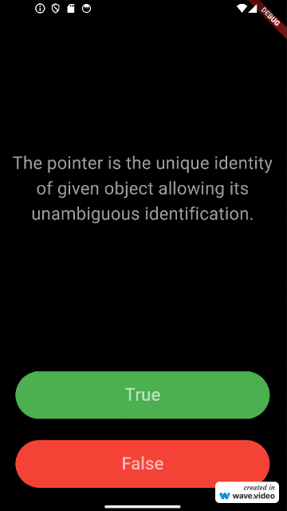

# Quizlet
## About
Simple quiz application where you can check your programming knowledge. 

## Content
- [App examples](./README.md#app-examples)
- [How to run the app?](./README.md#how-to-run-the-app)
  - [Environment](./README.md#environment)
  - [Used technologies](./README.md#used-technologies)
  - [Run the app](./README.md#run-the-app)
- [Note](./README.md#note)

## App examples
Examples photos of use are in [folder](./assets/images)

## How to run the app?
### Environment
- Windows 11 Pro v22H2

### Used technologies
- Android Studio
- Flutter
- Dart

### Run the app
Download files from github
```
git clone https://github.com/Susannnnnna/Flutter_Quizlet
```
Open application in Android Studio

## Note
